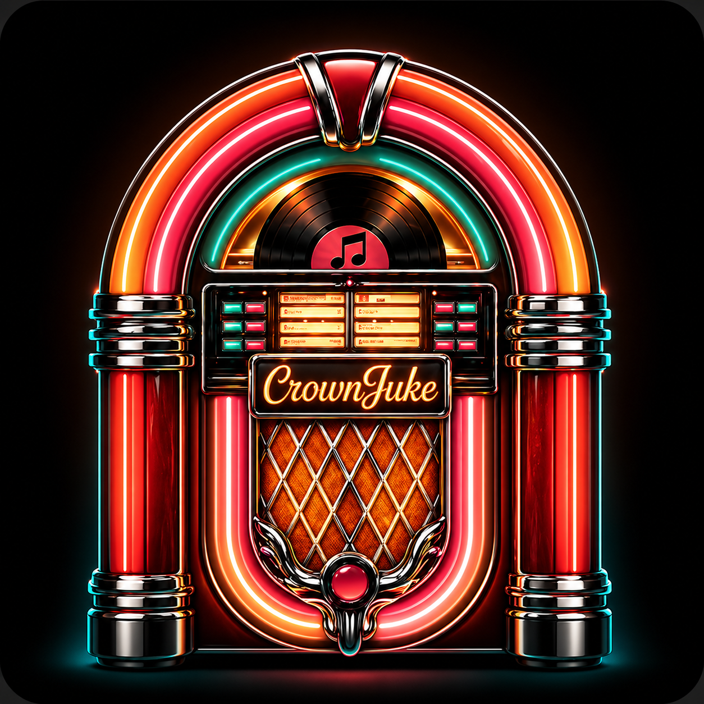
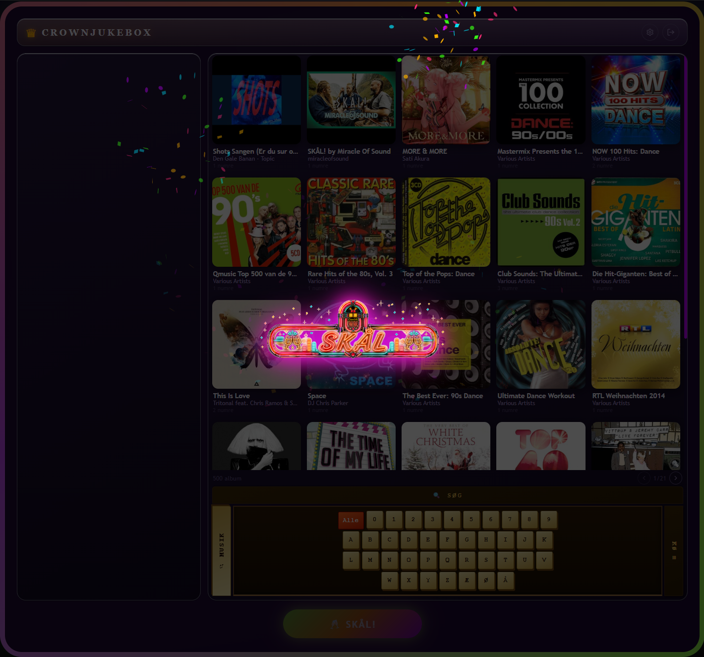
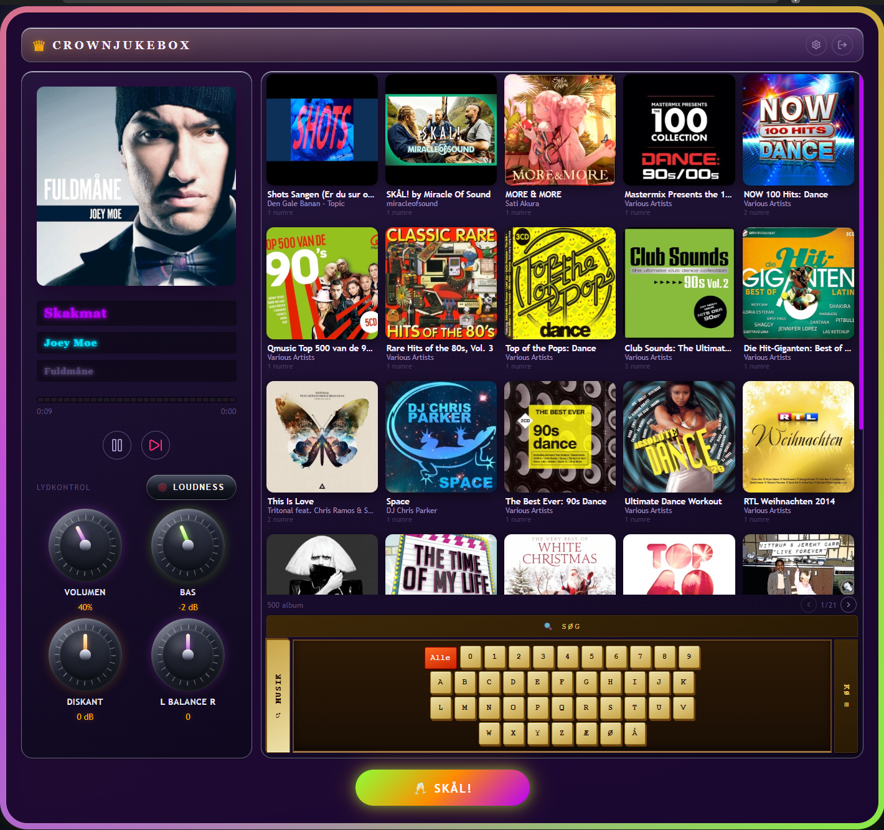
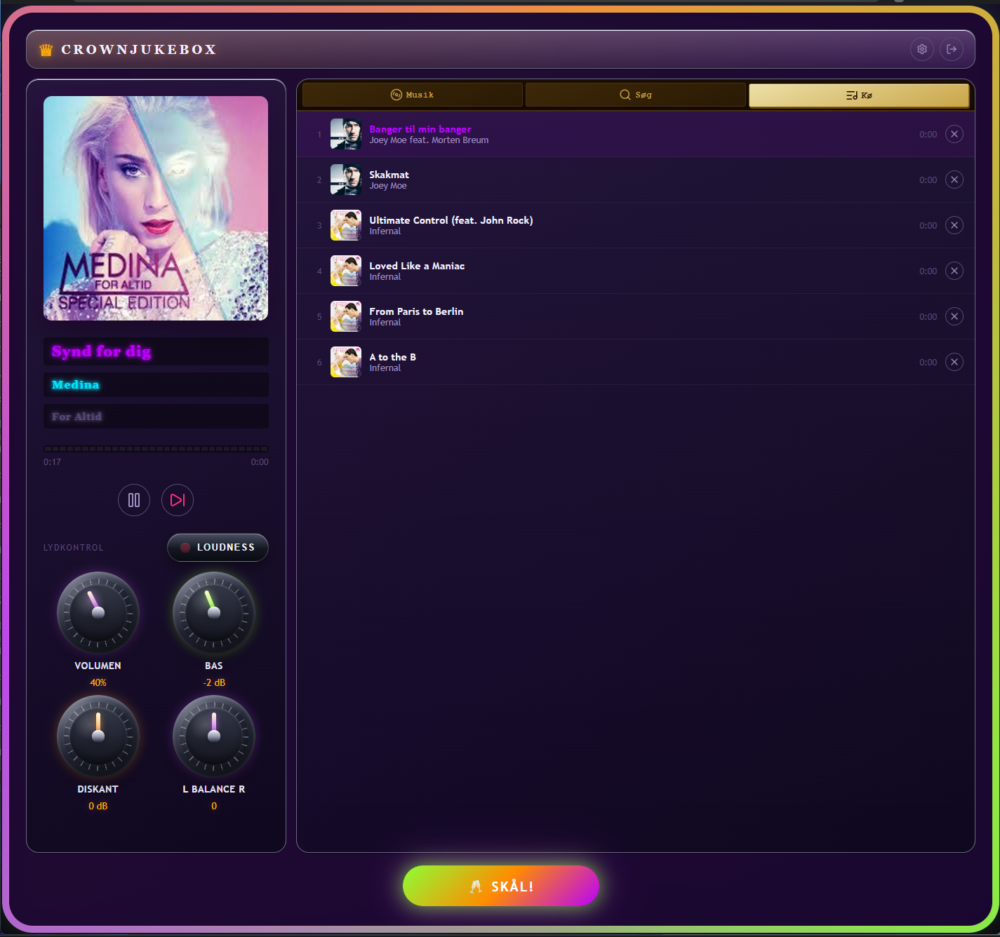
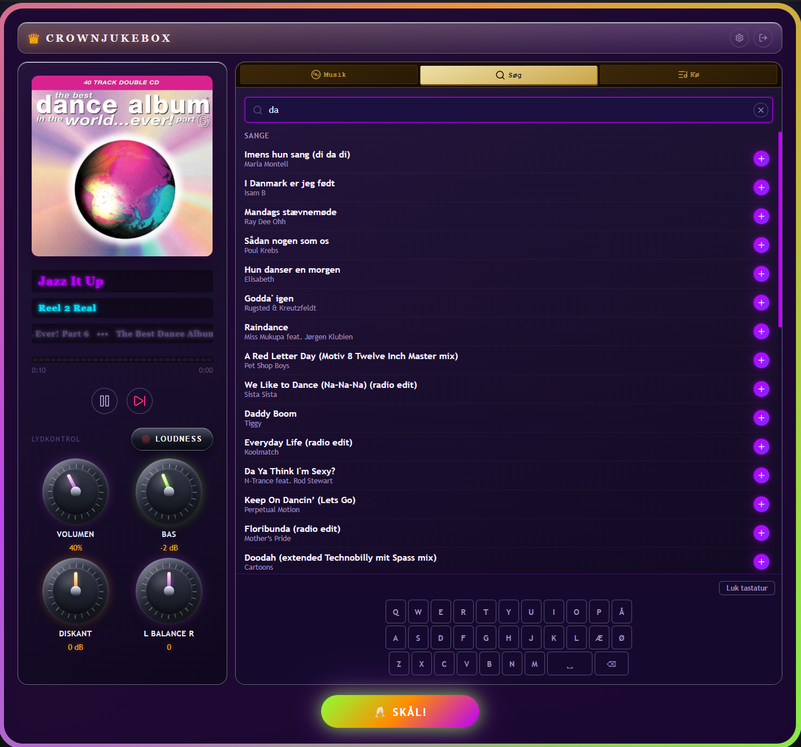
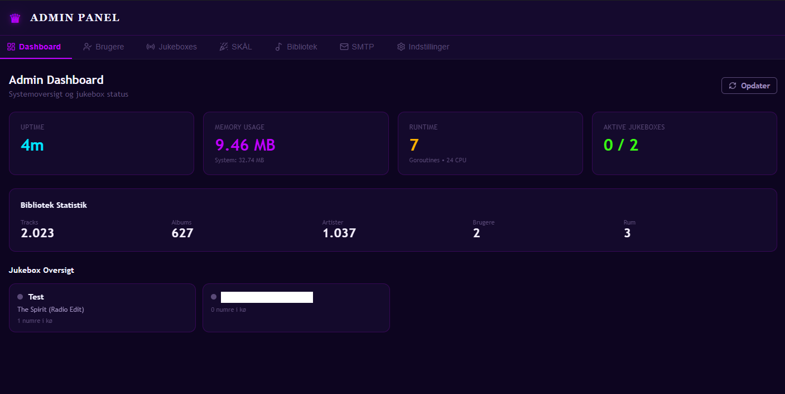

<div align="center">
  

  # CrownJukebox

  **A self-hosted, retro-styled party jukebox — multi-user, real-time, no cloud required.**

  [](https://github.com/Kronborgs/crownjukebox/releases)
  [](LICENSE)
  [](https://hub.docker.com/r/kronborgs/crownjukebox)
  [](https://go.dev/)
  [](https://react.dev/)
</div>

---

## What is CrownJukebox?

CrownJukebox is a **self-hosted jukebox server** you run at home or at your venue. It turns your local music collection into a shared, browser-based jukebox that multiple people can control from their own devices — no app install, no Spotify account, no cloud subscription.

The idea is simple: you put a screen (TV, monitor, or tablet) in your living room showing the **kiosk view** — the retro-styled "Now Playing" display with a vinyl animation, LED-scrolling track name, and audio controls. Your guests then open the jukebox on their **phone browser**, browse your music library, and add songs to the shared queue. Everything updates in real-time across all connected devices.

When the moment calls for it, whoever has permission can hit the **SKÅL!** button — and the entire screen explodes into a full-screen neon animation with confetti and a party track from your dedicated party playlist.

---

## Screenshots

### Kiosk view — the main screen on your TV


### Mobile view — guests add tracks from their phone


### SKÅL! — full-screen party animation


### Album browser — retro dial navigation


### Queue — see and manage what's coming up


### Search — find any track in your library instantly


### Admin panel — manage users, settings, and library


---

## How it works

```
Your music files (MP3/FLAC)
        │
        ▼
  CrownJukebox backend (Go)
  ┌─────────────────────────────────────────┐
  │  Music scanner → SQLite library DB      │
  │  Cover art extractor → thumbnail cache  │
  │  Playback state machine                 │
  │  Queue manager (user + autoplay tracks) │
  │  SSE hub → pushes live events to all    │
  │  connected browsers instantly           │
  └─────────────────────────────────────────┘
        │                        │
        ▼                        ▼
  TV / Kiosk browser      Guest phones
  (NowPlaying + controls)  (Browse + Add to queue)
```

When someone adds a track, every connected browser knows within milliseconds — the queue, the now-playing display, and the audio all update in sync. No polling, no page refresh needed.

The **audio streams directly from the backend** to the kiosk browser. The kiosk is the speaker — guests just control what's playing.

---

## Key Features

### 🎵 Playback & Queue
- Streams MP3/FLAC directly from your files to the browser — no transcoding needed
- Shared queue visible to everyone in real-time
- Add, remove, and reorder tracks in the queue
- **Autoplay** — when the queue runs out, CrownJukebox automatically picks tracks from your library based on what hasn't been played recently. The moment a user adds a real track, autoplay steps aside and the user's track starts immediately
- Play / Pause / Skip with full position tracking
- Playback history per room

### 🎉 SKÅL! Party Mode
- One tap triggers a full-screen neon + confetti explosion on the kiosk
- A random track from your party playlist starts playing automatically
- Volume can be boosted automatically during the party moment
- Whatever was playing before is restored when the party track ends
- Permission-gated: only users you trust can trigger it

### 🎨 Retro UI
- Inspired by 1960s/70s jukeboxes — neon colours, chrome details, amber LED displays
- Vinyl record animation while music plays
- LED-scrolling track name for long titles
- **Kiosk layout** designed for a TV or wall-mounted screen: large NowPlaying view, tabbed navigation for Queue and Browse
- **Mobile layout** designed for phones: touch-friendly, fast to navigate and add tracks
- Smooth Framer Motion animations throughout
- First-run setup wizard — no config files to edit manually

### 📚 Music Library
- Recursively scans a mounted music directory for MP3, FLAC, and other audio formats
- Extracts cover art from audio tags (ID3 / FLAC metadata), falls back to `folder.jpg`, and generates a retro placeholder for albums with no art
- Generates and caches thumbnail images in multiple sizes for fast browsing
- Browse by artist → album → tracks using a retro dial selector
- Full-text search across tracks, albums, and artists
- Optional integration with a Subsonic/Navidrome server as an alternative music source

### 👥 Multi-user & Access Control
- **User accounts** with username + PIN — admin creates them, guests never need to register themselves
- **QR code guest access** — generate a scannable link (with optional expiry date) and print it or put it on a table card. Guests scan and are immediately logged in as a guest user
- **Email invitations** — send a login link directly to a user via SMTP
- **Permission flags** per user: `can_search`, `can_view_queue`, `can_add_to_queue`, `can_use_party_button` — full control over what each person can do
- **Session management** — admin can see all active logins and revoke any session
- Each user gets their own **room** (their own queue and playback context)

### ⚙️ Admin Panel
- Create, edit, enable/disable, extend expiry, or delete users
- Trigger a full library rescan or artwork-only rescan at any time
- Change all settings at runtime (autoplay on/off, SMTP config, guest permissions, audio settings, keyboard shortcuts) — no restart needed
- Manage QR access links: create new ones, set expiry, revoke instantly
- Assign a party playlist to each room
- Configure keyboard bindings for kiosk installs (useful for a physical button panel)

### 🚀 Self-hosting & Deployment
- **Multi-arch Docker image** — runs on both `amd64` (regular PC/server) and `arm64` (Raspberry Pi 4/5, Apple Silicon)
- **Pure-Go SQLite** — no external database to install or maintain; all data in a single file with automatic schema migrations on startup
- **Portainer** — import `portainer-stack.yml` directly in Portainer Stacks
- **Unraid** — community template included
- Real-time updates via **Server-Sent Events** (SSE) — works through most firewalls and proxies; no WebSocket setup needed

---

## Quick Start

```bash
git clone https://github.com/Kronborgs/crownjukebox.git
cd crownjukebox
```

Edit `docker-compose.yml` and set at minimum:
- `ADMIN_PASSWORD` — your admin password
- `JWT_SECRET` — a long random string (e.g. `openssl rand -hex 32`)
- The volume path to your music: `/your/music:/music:ro`

Then start it:

```bash
docker compose up -d
```

Open `http://localhost:3000` in your browser. The **setup wizard** will guide you through the first-time configuration.

---

## docker-compose.yml example

```yaml
services:
  backend:
    image: ghcr.io/kronborgs/crownjukebox-backend:latest
    volumes:
      - /your/music:/music:ro          # your music library (read-only)
      - crownjukebox_data:/data        # database + artwork cache
    environment:
      ADMIN_USERNAME: admin
      ADMIN_PASSWORD: your-secure-password
      JWT_SECRET: change-this-to-a-long-random-string
      MUSIC_DIR: /music
    restart: unless-stopped

  frontend:
    image: ghcr.io/kronborgs/crownjukebox-frontend:latest
    ports:
      - "3000:80"
    depends_on:
      - backend
    restart: unless-stopped

volumes:
  crownjukebox_data:
```

---

## Environment Variables

| Variable | Default | Description |
|---|---|---|
| `ADMIN_USERNAME` | `admin` | Admin username |
| `ADMIN_PASSWORD` | *(required)* | Admin password / PIN |
| `JWT_SECRET` | *(required)* | Secret key for session tokens — **always change this** |
| `MUSIC_DIR` | `/music` | Path inside the container to your music directory |
| `DB_PATH` | `/data/crownjukebox.db` | SQLite database file path |
| `ARTWORK_CACHE_DIR` | `/data/artwork-cache` | Thumbnail cache directory |
| `SESSION_TTL_HOURS` | `24` | How long a login session lasts (hours) |
| `ALLOWED_ORIGINS` | `*` | CORS allowed origins — set to your domain in production |
| `ALLOW_GUEST_SEARCH` | `true` | Whether guests can search the library |
| `ALLOW_GUEST_QUEUE_ADD` | `true` | Whether guests can add tracks to the queue |
| `ALLOW_GUEST_PARTY_BUTTON` | `false` | Whether guests can trigger SKÅL! |
| `SUBSONIC_ENABLED` | `false` | Enable Subsonic/Navidrome as music source |
| `SUBSONIC_URL` | *(empty)* | Subsonic server base URL |
| `SUBSONIC_USERNAME` | *(empty)* | Subsonic username |
| `SUBSONIC_PASSWORD` | *(empty)* | Subsonic password |

---

## Deployment options

### Portainer
Import `portainer-stack.yml` in Portainer → Stacks → Web editor and fill in your environment variables.

### Unraid
Import `unraid-templates/crownjukebox.xml` via Unraid Community Applications, or add the template URL manually.

### Reverse proxy (nginx / Traefik)
The frontend container serves the React app on port 80. The backend API listens internally on port 8080 and is proxied by the frontend nginx config — you only need to expose the frontend port. Set `ALLOWED_ORIGINS` to your public domain.

---

## Building multi-arch images

```bash
# Requires: docker buildx configured and docker login
chmod +x build-multiarch.sh
./build-multiarch.sh 0.1.0
```

This builds and pushes `linux/amd64` + `linux/arm64` images in a single manifest.

---

## Architecture

```
frontend/          React 19 + TypeScript + Vite + Framer Motion + TanStack Query
backend/           Go + Chi v5 + modernc SQLite (pure Go — no CGO, no gcc needed)
  cmd/server/      Entry point — loads config, runs migrations, starts HTTP server
  internal/
    api/           HTTP handlers + Chi router — all REST endpoints
    auth/          JWT session tokens, auth middleware, QR login flow
    artwork/       Cover art extraction from audio tags, thumbnail generator, cache
    config/        Environment variable configuration with defaults
    db/            SQLite connection pool, schema migrations (runs on startup)
    email/         SMTP service for sending invite emails
    events/        SSE hub — broadcasts typed events to all connected browser clients
    music/         Recursive file scanner — builds the library in SQLite
    party/         SKÅL! engine — selects party tracks, manages party state
    playback/      Playback state machine (play/pause/skip/autoplay/history)
    queue/         Queue manager — user tracks + autoplay items, ordering
    rooms/         Per-user room management (each user = one room)
    subsonic/      Optional Subsonic/Navidrome API client
```

### Real-time events (SSE)

All live updates use Server-Sent Events. The backend broadcasts named events to room-specific subscribers:

| Event | Trigger |
|---|---|
| `now_playing_changed` | Track changes |
| `queue_changed` | Queue is modified |
| `playback_state_changed` | Play/pause/position update |
| `party_started` | SKÅL! triggered |
| `party_ended` | Party track finished, normal playback restored |
| `settings_changed` | Admin changes a setting |
| `user_access_revoked` | Admin revokes a user's access |

---

## License

MIT — use it, host it, fork it, share it.
